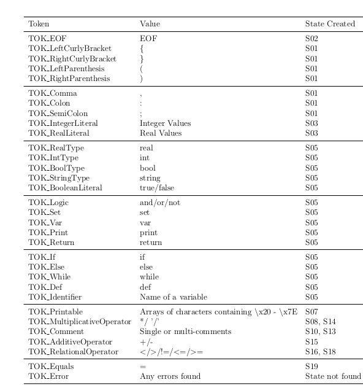

# Building a Compiler using C++

The following shows how a table-driven lexer, hand-crafted top-down parser, visitor classes to perform semantic analysis and execution on the AST produced and REPL were designed.

## Table-Driven Lexer

The lexer will be implemented using the table-driven approach which encodes the DFA transition function of the MiniLang micro-syntax. The lexer will be implemented in such a way that lexical errors found in the input program will be detected and showing the line number of the error.

The finite-state automata used for the lexer:

The classifiers used:

The tokens used:

## Parser

A top down hand-crafted recursive descent parser will be implemented for MiniLang. After the lexical analysis, the lexer will pass the tokens via getNextToken() function found in the lexer. The parser will report any syntax errors in the input program and will produce an abstract syntax tree if no errors were encountered.

The Abstract Syntax Tree is the following. The ASTNode is the main node that contains the 0 to many statements of the input program. The parser will start to evaluate the 0 or many statements of the input program.

The class AST Statement Node itself is an abstract class and thus a statement node can be one of the children which are shown in the figure.

The class AST Expression Node itself is an abstract class and thus a statement node can be one of the children which are shown in the figure. It is to node that ASTBinaryExprNode is used to hold all operators used for MiniLang. Also ASTLiteralNode is an abstract class as well.

## Visitor Pattern

The semantic analysis and the interpreter were done using visitor pattern. More information can be found in the report.

## Read Execute Print Loop

REPL is a python like terminal application were statements can be read and executed by the program. It also contains some basic commands like loading a file and display the stack.

## Build

Use CMake

## License

This project is licensed under MIT.
